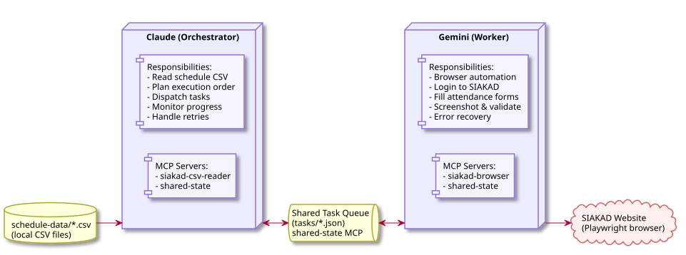
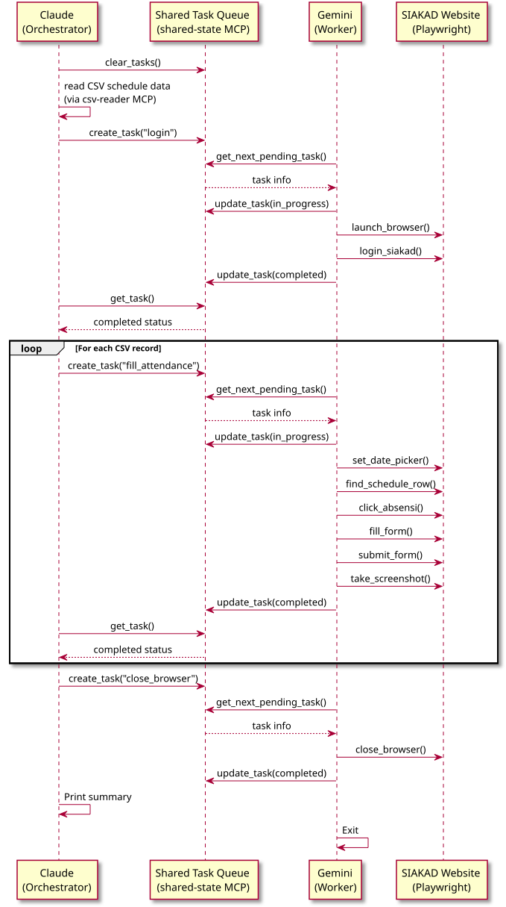

# SIAKAD Attendance Auto-Filler

A multi-agent system that automates filling **Berita Acara Perkuliahan** (lecture attendance reports) on [SIAKAD Pradita University](https://siakad.pradita.ac.id). The system uses two AI agents — **Claude** as the orchestrator/planner and **Gemini** as the browser worker — communicating through a shared task queue via the [Model Context Protocol (MCP)](https://modelcontextprotocol.io/).

---

## Table of Contents

- [Overview](#overview)
- [Architecture](#architecture)
- [Sequence Diagram](#sequence-diagram)
- [Project Structure](#project-structure)
- [Prerequisites](#prerequisites)
- [Installation](#installation)
- [Configuration](#configuration)
- [Preparing Schedule Data](#preparing-schedule-data)
- [Running the System](#running-the-system)
- [Troubleshooting](#troubleshooting)

---

## Overview

Filling attendance reports on SIAKAD is a repetitive task: for each lecture session, you must log in, navigate to the attendance page, select a date, click the correct class row, and fill in the topic and description. This system automates the entire process using:

- **Claude CLI** (Anthropic) as the **Orchestrator Agent** — reads schedule data from CSV files, plans the execution order, dispatches tasks, and monitors progress.
- **Gemini CLI** (Google) as the **Browser Worker Agent** — controls a real browser via Playwright, logs into SIAKAD, navigates pages, fills forms, and validates results using its strong visual understanding.
- **MCP Servers** as the tool layer — three Python-based MCP servers provide the tools that agents call:
  - `siakad-csv-reader` — reads and parses schedule CSV/Excel files
  - `siakad-browser` — Playwright browser automation (login, navigate, click, fill, screenshot)
  - `shared-state` — task queue for inter-agent communication via JSON files

---

## Architecture



---

## Sequence Diagram



---

## Project Structure

```
session-11/
├── README.md                          # This file
├── CLAUDE.md                          # Instructions for Claude CLI
├── GEMINI.md                          # Instructions for Gemini CLI
├── config.json                        # Credentials, URLs, and settings
│
├── schedule-data/                     # Schedule CSV files (one per course)
│   └── advanced_software_engineering_and_devops.csv
│
├── mcp-servers/                       # MCP tool servers
│   ├── browser-automation/
│   │   ├── server.py                  # Playwright browser automation (15 tools)
│   │   └── run.sh                     # Launcher script
│   └── csv-reader/
│       ├── server.py                  # CSV/Excel reader (4 tools)
│       └── run.sh                     # Launcher script
│
├── agents/                            # Multi-agent components
│   ├── shared_state.py                # Task queue MCP server (6 tools)
│   ├── run_shared_state.sh            # Launcher script
│   ├── orchestrator_prompt.md         # Claude orchestrator instructions
│   └── worker_prompt.md               # Gemini worker instructions
│
├── tasks/                             # Task queue files (created at runtime)
│
├── .claude/settings.json              # Claude CLI MCP config
├── .gemini/settings.json              # Gemini CLI MCP config
│
├── run_multiagents.sh                 # Multi-agent mode (Claude + Gemini)
├── run_claude_only.sh                 # Single-agent mode (Claude only)
├── run_claude_interactive.sh          # Interactive single-agent mode (Claude)
└── run_gemini_only.sh                 # Single-agent mode (Gemini only)
```

---

## Prerequisites

| Tool | Version | Purpose |
|------|---------|---------|
| Python | >= 3.10 | Runtime for MCP servers |
| Node.js | >= 18 | Required by Gemini CLI |
| Claude CLI | >= 2.0 | Orchestrator agent |
| Gemini CLI | >= 0.30 | Browser worker agent |
| Chromium | (auto-installed) | Browser for Playwright |

---

## Installation

### 1. Install Python (if not already installed)

Download from [python.org](https://www.python.org/downloads/) or use your system package manager:

```bash
# Ubuntu/Debian
sudo apt update && sudo apt install python3 python3-venv python3-pip

# macOS (via Homebrew)
brew install python@3.12

# Verify
python3 --version   # Should be >= 3.10
```

### 2. Install Node.js (if not already installed)

Download from [nodejs.org](https://nodejs.org/) or use nvm:

```bash
# Using nvm (recommended)
curl -o- https://raw.githubusercontent.com/nvm-sh/nvm/v0.40.0/install.sh | bash
nvm install 20
nvm use 20

# Verify
node --version   # Should be >= 18
npm --version
```

### 3. Install Claude CLI

Follow the official installation guide at [claude.ai/download](https://claude.ai/download):

```bash
# npm (global install)
npm install -g @anthropic-ai/claude-code

# Verify
claude --version
```

You will need an Anthropic API key or Claude Pro/Max subscription. Run `claude` and follow the authentication prompts.

### 4. Install Gemini CLI

Follow the official installation guide at [github.com/google-gemini/gemini-cli](https://github.com/google-gemini/gemini-cli):

```bash
# npm (global install)
npm install -g @anthropic-ai/gemini-cli

# Verify
gemini --version
```

You will need to authenticate with Google. Run `gemini` and follow the OAuth prompts.

### 5. Create Python virtual environment and install dependencies

```bash
# Create virtual environment
python3 -m venv ~/venv

# Activate it
source ~/venv/bin/activate

# Install Python dependencies
pip install "mcp[cli]" playwright pandas openpyxl

# Install Chromium browser for Playwright
playwright install chromium
```

### 6. Clone/navigate to the project

```bash
cd /path/to/session-11
```

### 7. Register Gemini MCP servers (first time only)

Claude's MCP servers are configured via `.claude/settings.json` (already included).
Gemini needs its servers registered for use with `gemini` CLI.

> **Note**: The provided `run_*.sh` scripts automatically register these servers for you using `--scope project`. If you want to run them manually:

```bash
cd /path/to/session-11

# Browser automation (used by Worker and Gemini-Only modes)
gemini mcp add --scope project siakad-browser ./mcp-servers/browser-automation/run.sh -e DISPLAY=:0

# Shared state queue (used by Worker mode)
gemini mcp add --scope project shared-state ./agents/run_shared_state.sh

# CSV reader (used by Gemini-Only mode)
gemini mcp add --scope project siakad-csv-reader ./mcp-servers/csv-reader/run.sh
```

---

## Configuration

Edit `config.json` with your SIAKAD credentials and URLs:

```json
{
  "siakad": {
    "login_url": "https://siakad.pradita.ac.id/login",
    "daftar_hadir_url": "https://siakad.pradita.ac.id/dosen/daftar_hadir",
    "username": "your.email@pradita.ac.id",
    "password": "your_password"
  },
  "schedule_dir": "./schedule-data"
}
```

> **Note**: Keep `config.json` out of version control if you commit this project. Add it to `.gitignore`.

---

## Preparing Schedule Data

Place one CSV file per course in the `schedule-data/` directory. Use lowercase filenames with underscores for spaces (e.g., `advanced_software_engineering_and_devops.csv`).

### CSV Format

| Column | Required | Description |
|--------|----------|-------------|
| `no` | No | Session number (for reference) |
| `semester` | No | Semester name (e.g., `2025/2026 GENAP`) |
| `tanggal` | Yes | Date in `YYYY-MM-DD` format |
| `mata_kuliah` | Yes | Course name (must match what appears on SIAKAD) |
| `kelompok_kelas` | No | Class group (e.g., `Kelas A`, `Kelas B`, or `-` if N/A) |
| `topik` | Yes | Lecture topic |
| `deskripsi` | Yes | Lecture description |

### Example

```csv
no,semester,tanggal,mata_kuliah,kelompok_kelas,topik,deskripsi
1,2026-01-21,Advanced Software Engineering & DevOps,-,General Lecture,"Overview of course objectives and introduction to DevOps"
2,2026-01-28,Advanced Software Engineering & DevOps,-,Docker-based Software System,"Building software systems using Docker containers"
```

### Multiple classes on the same date

If you teach the same course to different class groups, create separate files or include all groups in one file:

```csv
no,semester,tanggal,mata_kuliah,kelompok_kelas,topik,deskripsi
1,2026-01-21,Pemrograman Berorientasi Objek,Kelas A,Introduction to OOP,"Class, object, encapsulation"
2,2026-01-21,Pemrograman Berorientasi Objek,Kelas B,Introduction to OOP,"Class, object, encapsulation"
```

---

## Running the System

### Option 1: Multi-Agent Mode (Recommended)

Runs Claude as orchestrator and Gemini as browser worker. Best for reliability — Claude plans while Gemini's visual capabilities handle the browser.

```bash
cd /path/to/session-11
./run_multiagents.sh
```

What happens:
1. Gemini starts in the background, polling for tasks
2. Claude reads all CSV files and dispatches tasks one by one
3. Gemini picks up each task: logs in, fills forms, takes screenshots
4. Claude monitors progress and reports a summary when done

### Option 2: Single-Agent Mode

Runs Claude only with all MCP servers. Simpler but Claude handles both planning and browser automation.

```bash
./run_claude_only.sh
```

### Option 3: Interactive Mode

Launches Claude in chat mode so you can guide it step by step. Useful for testing or when you want manual control.

```bash
./run_claude_interactive.sh
```

Then type prompts like:
```
> List all schedule files
> Launch browser and login
> Fill attendance for 2026-01-21
> Take a screenshot
```

### Option 4: Gemini-Only Mode

Runs Gemini only with all MCP servers. Gemini handles both reading the schedule and browser automation.

```bash
./run_gemini_only.sh
```

### Custom schedule directory

All scripts accept an optional path argument:

```bash
./run_multiagents.sh /path/to/my/schedules
./run_claude_only.sh /path/to/my/schedules
./run_gemini_only.sh /path/to/my/schedules
```

---

## Troubleshooting

### Browser doesn't open

Make sure the `DISPLAY` environment variable is set correctly in your config. Check with:
```bash
echo $DISPLAY
```
Update the value in `.gemini/settings.json` and `.claude/settings.json` if needed.

### Playwright can't find Chromium

Re-install the browser:
```bash
source ~/venv/bin/activate
playwright install chromium
```

### MCP server fails to start

Test each server individually:
```bash
source ~/venv/bin/activate
python mcp-servers/csv-reader/server.py      # Should hang (waiting for stdin), Ctrl+C to exit
python mcp-servers/browser-automation/server.py
python agents/shared_state.py
```

### Form selectors don't match

The SIAKAD page structure may change. If the agent can't find form fields:
1. Use `take_screenshot` to see the current page
2. Use `get_page_html` to inspect the HTML
3. Use `click_element` and `fill_input` with specific CSS selectors

### Task stuck in "in_progress"

If a task gets stuck, clear the queue and restart:
```bash
rm -f tasks/*.json
./run_multiagents.sh
```
